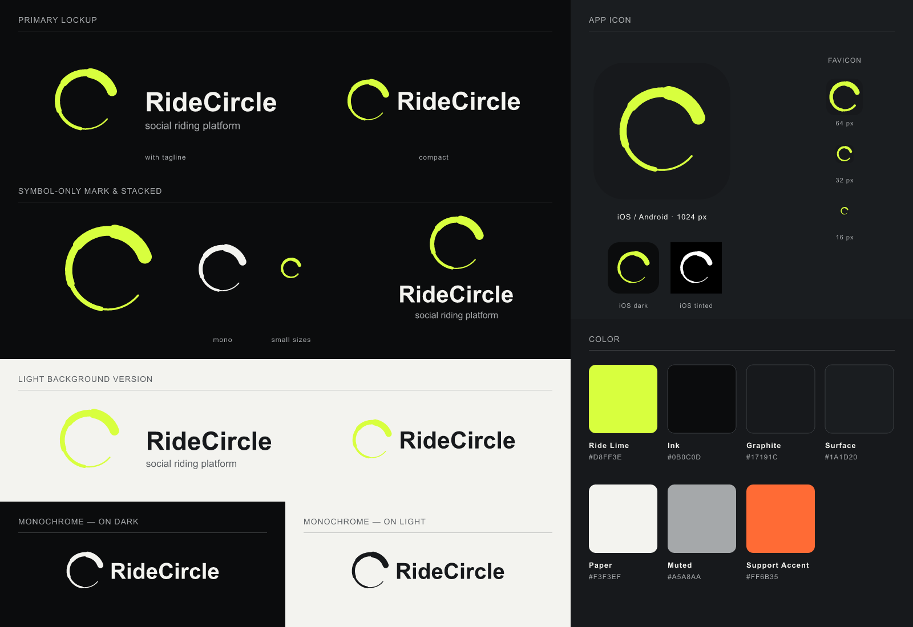

# RideCircle — Brand Assets

Semua variant di folder ini **di-generate** dari dua file master di root repo:

| Master | Yang diambil |
|---|---|
| [`ridecircle-symbol.svg`](../ridecircle-symbol.svg) | Geometri mark: 5 busur r=60 dengan stroke 3→21, round cap |
| [`ridecircle-lockup.svg`](../ridecircle-lockup.svg) | Layout lockup, wordmark "RideCircle" (Arial Bold 36), tagline "social riding platform" (Arial 14), warna |

Jangan edit file hasil secara manual. Kalau mark atau lockup berubah, ubah file master lalu jalankan ulang generator (lihat [Regenerate](#regenerate)). Sistem variant dan palet pendukung mengikuti brand board referensi.



---

## Pilih file yang mana?

| Kebutuhan | File |
|---|---|
| Logo utama di background gelap (website, splash, presentasi) | `logo/lockup/ridecircle-lockup-on-dark.svg` |
| Logo di background terang (dokumen, print) | `logo/lockup/ridecircle-lockup-on-light.svg` |
| Header app/web, navbar, ruang horizontal sempit | `logo/lockup-compact/ridecircle-lockup-compact-*.svg` (tanpa tagline) |
| Layout persegi/vertikal (splash, poster, merchandise) | `logo/lockup-stacked/ridecircle-lockup-stacked-*.svg` |
| Satu warna: emboss, stempel, watermark share card, background berfoto | `*-mono-white.svg` / `*-mono-black.svg` |
| Teks nama saja | `logo/wordmark/` |
| Mark saja, ukuran ≥ 48 px | `symbol/ridecircle-symbol.svg` (+ mono) |
| Mark saja, ukuran ≤ 32 px | `symbol/ridecircle-symbol-small.svg`: stroke ujung tipis ditebalkan agar tidak hilang saat dirasterisasi |

### Aplikasi mobile

| Platform | File | Cara pakai |
|---|---|---|
| **iOS** | `ios/AppIcon.appiconset/` | Salin ke `Assets.xcassets/`. Isi: ikon 1024 (tanpa alpha, sesuai syarat App Store) plus appearance **dark** dan **tinted** untuk iOS 18+ |
| iOS: App Store Connect | `ios/AppStore-1024.png` | Upload marketing icon |
| **Android** | `android/res/` | Salin isinya ke `app/src/main/res/`. Isi: adaptive icon (foreground vector + background color + **monochrome** untuk themed icon Android 13+), mipmap legacy mdpi–xxxhdpi (square & round) |
| Android: splash screen (12+) | `android/res/drawable/splash_icon.xml` | `windowSplashScreenAnimatedIcon`; background pakai `@color/ic_launcher_background` |
| Android: notifikasi | `android/res/drawable/ic_stat_ridecircle.xml` | `setSmallIcon()`, siluet putih 24dp |
| Google Play Console | `android/play-store-icon-512.png` | Hi-res icon |
| Master app icon (SVG) | `app-icon/` | `app-icon.svg` (full-bleed; sudut dibulatkan oleh OS), `-dark`, `-tinted`, `-rounded-preview` (hanya untuk mockup/presentasi) |

### Web (`web/`, untuk `web/public/`)

| File | Tag |
|---|---|
| `favicon.ico` (16/32/48) | `<link rel="icon" href="/favicon.ico" sizes="48x48">` |
| `favicon.svg` | `<link rel="icon" href="/favicon.svg" type="image/svg+xml">` |
| `apple-touch-icon.png` (180) | `<link rel="apple-touch-icon" href="/apple-touch-icon.png">` |
| `icon-192.png`, `icon-512.png`, `icon-maskable-512.png` | Direferensikan oleh `site.webmanifest` (PWA / Add to Home Screen) |
| `site.webmanifest` | `<link rel="manifest" href="/site.webmanifest">` |
| `safari-pinned-tab.svg` | `<link rel="mask-icon" href="/safari-pinned-tab.svg" color="#0B0C0D">` |

Di Next.js App Router, `favicon.ico`, `icon.svg`, dan `apple-icon.png` juga bisa diletakkan langsung di `app/` (lihat `web/docs/CODING_STANDARDS.md`).

### Sosial & link preview

| File | Pakai untuk |
|---|---|
| `social/og-image-1200x630.png` | `og:image` / `twitter:image` |
| `social/avatar-1080.png` | Foto profil Instagram, X, TikTok, WhatsApp Business. Aman untuk crop lingkaran |

---

## Warna

| Nama | Hex | Peran |
|---|---|---|
| Ride Lime | `#D8FF3E` | Mark, aksen utama. Dari master |
| Ink | `#0B0C0D` | Background gelap utama. Dari master |
| Paper | `#F3F3EF` | Wordmark di gelap, background terang. Dari master |
| Muted | `#A5A8AA` | Tagline, teks sekunder. Dari master |
| Graphite | `#17191C` | Wordmark di terang, tile app icon |
| Surface | `#1A1D20` | Permukaan gelap sekunder |
| Support Accent | `#FF6B35` | Aksen pendukung (status, highlight). **Tidak dipakai di logo** |

## Aturan pakai

- **Clear space**: sisakan ruang kosong di sekeliling logo minimal setebal stroke paling tebal mark. Padding di dalam file SVG sudah memenuhi ini.
- **Ukuran minimum**: lockup dengan tagline ≥ 160 px lebar (tagline tidak terbaca di bawah itu, pakai compact); symbol standar ≥ 48 px; di bawah itu pakai `symbol-small`.
- **Lime di background terang** kontrasnya rendah. Untuk ukuran kecil atau cetak di kertas terang, pakai `mono-black`.
- Jangan ubah proporsi, memutar mark, mengganti warna di luar palet, atau menambah efek (glow/bayangan) pada file logo. Efek glow di brand board hanya untuk presentasi.

---

## Regenerate

Butuh Python 3.10+ dan Node.js 18+.

```bash
cd brand/tools
pip install -r requirements.txt
npm install
python build_brand.py
```

Generator menghapus lalu menulis ulang semua folder output di `brand/` (kecuali `tools/` dan `README.md`). Wordmark di-outline dari Arial (font yang ditentukan `ridecircle-lockup.svg`). Di luar Windows, set `RC_FONT_BOLD` dan `RC_FONT_REGULAR` ke path `arialbd.ttf` / `arial.ttf`.
